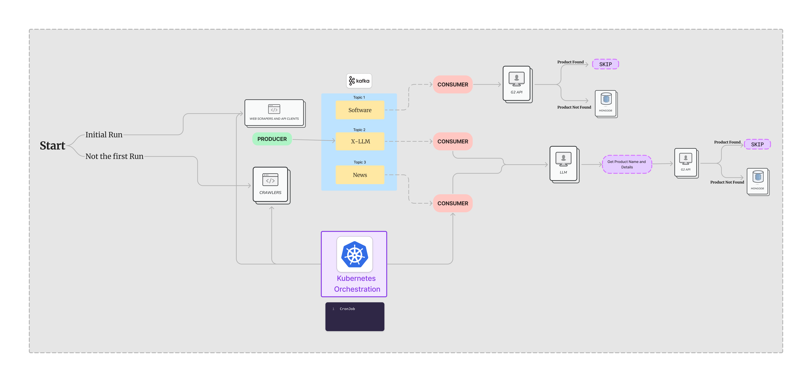
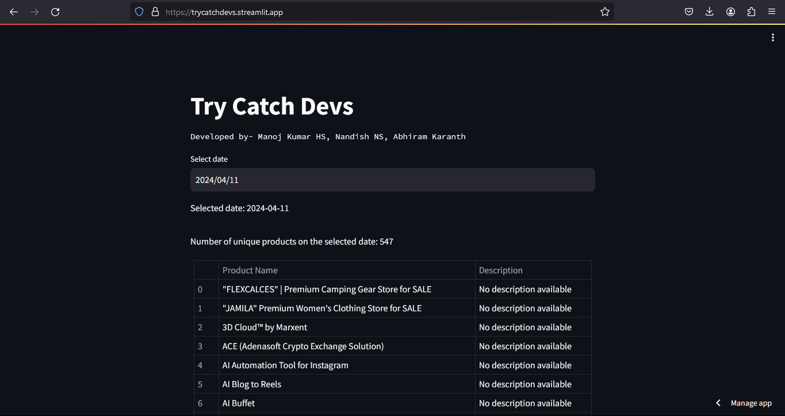

# Automated Software and Product Listing Platform

### Website
https://trycatchdevs.streamlit.app/

## Overview

This project automates the listing of B2B software products on G2, ensuring that new software is promptly and efficiently added to the G2 marketplace. By leveraging advanced web scraping techniques, real-time data streaming, and automated workflows, this system maximizes the visibility and accessibility of new software products, particularly in regions where G2 has low penetration.

## Problem Statement

1. G2 is the largest software marketplace in the world, with over 165,000 listed products and
   real reviews. Our mission is to help every software buyer make informed purchasing
   decisions. To achieve this, we want all B2B software products to be listed on G2 as soon as
   they become generally available. While this is common practice in North America, Asia,
   and some other countries, there are regions where G2 has low visibility and companies do
   not list their products with us. Therefore, we want to identify such products and get them
   listed on G2 proactively.
   As an aspiring Computer Science graduate, we would like you to develop a system that
   periodically identifies new GA products (daily, weekly, or monthly), checks their availability
   on G2 using the API provided below, and provides a list of any products that are not yet
   listed on G2 (this could be in a database or a CSV file).

## Project Goals

- **Fast and Efficient Listings:** Automate the detection and listing of new software products to ensure real-time updates.
- **Global Reach:** Capture and list software launches worldwide, especially from underrepresented regions.
- **Technological Innovation:** Utilize modern technologies including web scraping, real-time data streams, and cloud-native services to maintain an efficient workflow.

## Target Information Sources

### Product Information Sites

- **Description:** These are the primary sources where detailed and technical data about software products can be found. Key sources include software directories, official product pages, and industry-specific news portals.
- **Scraping Techniques:** Utilize BeautifulSoup for parsing HTML content from static pages and Selenium for interacting with JavaScript-driven dynamic web pages to extract critical data about software releases and updates.
- **Websites** ProductHunt, Slashdot, Betalist and many more tech news sites regularly post about new software products.

### News Websites and Social Media

- **Purpose:** To capture press releases, news articles, and social media posts that announce or discuss the launch of new B2B software products.
- **Approach:** Deploy custom crawlers through tech news portals like TechCrunch, Wired, and social media platforms such as Twitter and LinkedIn. These crawlers use Selenium to mimic human browsing patterns, ensuring timely and accurate data collection.
- Twitter/X so that the new products from these platforms can also be captured for listing.
- TechAfrica so that the products from low visilibility countries can be tracked.

## Technology Stack

- **Web Scraping:** BeautifulSoup, Selenium
- **Data Streaming:** Apache Kafka
- **Data Storage and Management:** MongoDB, Docker, Kubernetes
- **APIs and Advanced Processing:** G2 API, Large Language Models (LLMs)

## System Architecture



### Initial Setup

Comprehensive scrapers are deployed initially to perform a deep crawl of targeted sources to populate the database with existing software products. BeautifulSoup is used for static content and Selenium for dynamic content.

### Ongoing Operation

Scheduled daily crawls update the database with new additions and changes, managed via cron jobs or Kubernetes schedulers.

### Data Streaming

Extracted data is streamed in real-time into Kafka topics designed to segment the data efficiently:

- **software** for direct product data
- **x-llm** for processed textual data needing further extraction
- **news** for updates from news sources about software products

### Real-time Processing

Kafka consumers process data on-the-fly. If new products are detected via the G2 API, they are added to MongoDB.

### Advanced Text Analysis

LLMs analyze textual data from news and social media to extract and verify new product details.

### Orchestration and Scaling

Kubernetes ensures scalable and resilient deployment of all system components.

## Project Architecture


## Kafka Architecture


## Streamlit Website



```bash
https://trycatchdevs.streamlit.app/
```
## Kafka Setup

run this command in root directory of the project

```bash
# start zookeeper and kafka
 docker-compose up -d
```

shutdown the kafka and zookeeper

```bash
# stop zookeeper and kafka
 docker-compose down
```

## run scrapper

```bash
# Build the image
docker build -t scrape-products .
# run the image
docker run --network="host" scrape-products
```

## run consumers

```bash
# Build the product consumer
# Go to the respective directory
cd KafkaConsumer\Software
docker build -t software-consumer .
# run the image
docker run --network="host" software-consumer
```

```bash
# Build the product consumer
# Go to the respective directory
cd KafkaConsumer\TwitterLLM
docker build -t twitter-consumer .
# run the image
docker run --network="host" twitter-consumer
```

```bash
# Build the product consumer
# Go to the respective directory
cd KafkaConsumer\NewsLLM
docker build -t news-consumer .
# run the image
docker run --network="host" news-consumer
```

## create job

```bash

kubectl apply -f kafka-zoopkeeper-deployment.yaml

kubectl apply -f scrape-products-cronjob.yaml

kubectl apply -f product-cronjob.yaml

kubectl apply -f twitter-cronjob.yaml

kubectl apply -f news-cronjob.yaml
```

```bash

kubectl get cronjobs

kubectl get pods

kubectl get deployments
```
## mongodb atlas clustor


## Kubectl


